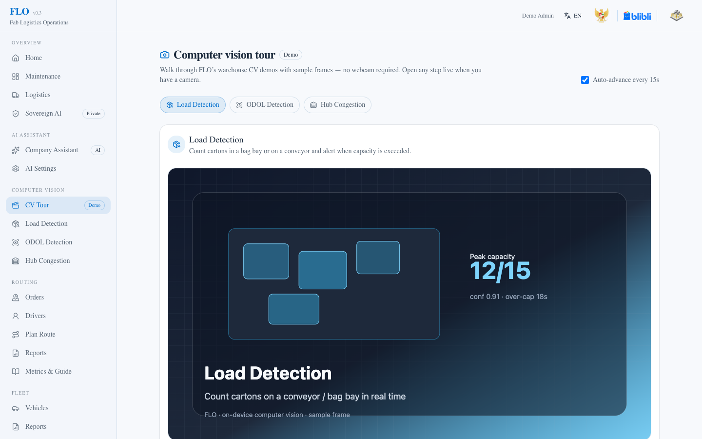
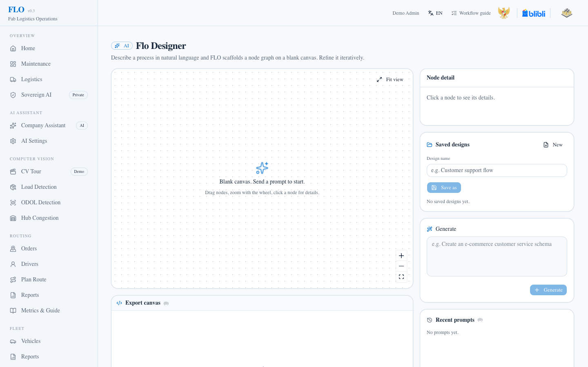

# FLO — Fab Logistics Operations

**One intelligence layer for every delivery.**

FLO is a **last-mile logistics operations cockpit** for Jakarta: predictive fleet health, traffic-aware low-carbon routing, and on-device warehouse computer vision — plus **Sovereign AI** and **Flo Designer** so operators can plan integrations without leaking data off the deployment.

Built by **Quasarian Radr-Lyon Dynasty** for the **AI Open Innovation Challenge 2026 (Blibli case)**.

> Motto: **01 Predict · 02 Route · 03 Verify**

| Try it | Link |
|--------|------|
| Live demo (login first) | [radr.nxtdev.xyz/flo-logistics/demo/login](https://radr.nxtdev.xyz/flo-logistics/demo/login) |
| Team site / final hub | [radr.nxtdev.xyz/flo-logistics/](https://radr.nxtdev.xyz/flo-logistics/) · [/final](https://radr.nxtdev.xyz/flo-logistics/final) |
| Source | [github.com/JustHackr/flo-logistics](https://github.com/JustHackr/flo-logistics) |


---

## Why Quasarian built FLO

**Quasarian Radr-Lyon Dynasty** is a three-person student team from **SMAS Pilar Indonesia**, building at **FabLab Jababeka**, with academic partners **Universitas Presiden** and case provider **Blibli**.

- **Justin Raditya Rizki** — Project Lead ([stetoradr.com](https://stetoradr.com) · [@JustHackr](https://github.com/JustHackr))
- **Arsene Matthew E. Naftali** — AI Engineer ([optivox.site](https://optivox.site) · [@abckids1202](https://github.com/abckids1202))
- **Nabiil Zhafran Alrilo Tarigan** — Designer & Interface ([foodloopai.vercel.app](https://foodloopai.vercel.app/) · [@abckids1202](https://github.com/abckids1202))

We did not start from a generic “AI for logistics” pitch. Blibli’s Jakarta last-mile reality hits three walls at once:

1. **SLA risk is opaque** — which vehicles will fail maintenance windows before a peak day?
2. **Routing cost & carbon climb** — congestion-aware plans that still respect fuel and CO₂.
3. **Compliance is still manual** — dock load checks and hub dwell still depend on humans watching cameras.

Existing tools either push operational prompts to foreign clouds, or they solve only one slice (maps *or* fleet *or* CV). Quasarian built **FLO** as a single SQLite-backed product that stays **sovereign by default**, runs on a laptop or VPS, and still shows judges a complete Predict → Route → Verify loop.

During the **2026 mentoring cycle** (online + onsite), mentors, operators, and fellow teams kept asking a different question: *how would FLO wire into a warehouse with no WMS, a CSV hub feed, or a telematics vendor with no public API?* That integration-planning gap became **Flo Designer** — prompt a process graph, overlay it on FLO’s live process map, save it, export JSON.

Competition journey: [pre-selection](https://radr.nxtdev.xyz/flo-logistics/pre-selection) → [semifinal](https://radr.nxtdev.xyz/flo-logistics/semifinal) → [final](https://radr.nxtdev.xyz/flo-logistics/final).

---

## Features

### Operations home

Role-aware dashboard: route progress, fleet VQI, and “needs attention” maintenance signals in one place. Personas (Admin, Ops Manager, Driver, Warehouse) share password `demo1234` in the demo.


### Predict — fleet health & maintenance

**Vehicle Quality Index (VQI)** scores age, odometer, maintenance cost, and planning factors. The fleet list and maintenance views surface high-risk units and a 90-day cost window before surprises hit the hub.


Code: [src/lib/vqi.ts](src/lib/vqi.ts), [src/lib/predictor.ts](src/lib/predictor.ts), routes `/vehicles`, `/dashboard`, `/reports`.

### Route — traffic-aware, low-carbon planning

Jakarta-aware optimization with **DTI** (delivery time), **CFI** (carbon), fuel cost, and driver–vehicle matching. Logistics monitors in-progress routes (progress, ETA, emissions).


Code: [src/lib/routing/](src/lib/routing/), routes `/routing/orders`, `/routing/plan`, `/routing/dashboard`.

### Verify — on-device computer vision

Load detection, hub congestion / dwell, and ODOL placeholder run **in the browser** — frames never upload. Judges can walk the story without a webcam via the CV tour.



Code: [src/lib/computer-vision/](src/lib/computer-vision/), routes `/computer-vision/tour`, `/computer-vision/load-detection`, `/computer-vision/hub-congestion-detection`.

### Flo Designer — prompt → graph → save → JSON

Admin workspace: describe a process in natural language, get a validated node graph, integrate with FLO’s process map, **save designs in SQLite**, export deterministic JSON. Drag nodes, inspect in a permanent detail pane, highlight what’s new after Refine.



Code: [src/lib/designer/](src/lib/designer/), route `/admin/designer` (ADMIN).

### Process map — system self-description

Swimlane of the whole FLO pipeline with live stats, drag, and a permanent detail pane — architecture readable without leaving the app.


Code: [src/lib/process-map/](src/lib/process-map/), route `/admin/process-map` (ADMIN).

### Sovereign AI

Prompts stay on the deployment by default (rule-based ops assistant over live SQLite). Operators may opt into any OpenAI-compatible / open-weight endpoint (Ollama, vLLM, …). Aligned with Stranas KA, UU PDP, UU ITE — see [SECURITY.md](SECURITY.md).


Route: `/sovereign-ai` · assistant: `/ai/chat`.

---

## What FLO does (summary)

| Module | Question it answers | Where |
|--------|---------------------|--------|
| **Predict** | Which vehicle is at risk, and when is the next service window? | VQI + predictor · `/vehicles`, `/dashboard` |
| **Route** | Lowest-time / carbon / cost assignment of orders to drivers? | [src/lib/routing/](src/lib/routing/) · `/routing/*` |
| **Verify** | Right load? Hub congested? Compliance without uploading video? | [src/lib/computer-vision/](src/lib/computer-vision/) · `/computer-vision/*` |

Shared data layer: SQLite + [src/lib/master-overview.ts](src/lib/master-overview.ts) + [src/lib/routing-overview.ts](src/lib/routing-overview.ts).

---

## Sovereign AI (default)

### Posture

By default, prompts never leave the deployment. Operators may opt into an OpenAI-compatible LLM by setting server-side environment variables.

| Mode | When | Behavior |
|------|------|----------|
| **Sovereign (default)** | No `AI_ALLOW_EXTERNAL` | In-process rule-based intent router ([src/lib/ai-chat.ts](src/lib/ai-chat.ts)) — answers from live SQLite, no model weights required. |
| **External (opt-in)** | `AI_ALLOW_EXTERNAL=true` + `AI_API_KEY` + `AI_BASE_URL` | OpenAI-compatible chat completions via [src/lib/ai-llm.ts](src/lib/ai-llm.ts); live company context is injected on every call. |

Credentials are read **exclusively** from server environment variables by [src/lib/ai-provider-store.ts](src/lib/ai-provider-store.ts:8-25). They are never accepted from the browser, never stored in the database, and never returned by `/api/ai/settings`. See [SECURITY.md](SECURITY.md) and the in-app **Sovereign AI** page (`/sovereign-ai`) for the full privacy posture. Maps, live traffic, and Pertamina fuel prices remain optional external services because they cannot run fully offline.

### Open-source & locally-installable

FLO is **open-source in spirit**: the dependency tree has no proprietary SDK, no model weights are bundled, and no SaaS lock-in is required to run it.

- **Stack:** Next.js 16 (App Router) + React 19 + Prisma 7 + SQLite (`better-sqlite3`) + Tailwind 4 — all listed in [package.json](package.json). The embedded database is configured in [prisma.config.ts](prisma.config.ts).
- **Single-process install:** `npm install && npm run dev` brings up the entire app on port 3000. No Docker, no managed services, no cloud account.
- **Sovereign default = zero model download.** The in-scope assistant is a hand-written intent router over live SQLite; the CV pipeline runs in the browser's `MediaStream`; nothing reaches out to a model server unless an operator opts in.
- **Pluggable open-weight LLM endpoint.** The optional external path hits `${AI_BASE_URL}/chat/completions` with `Authorization: Bearer ${AI_API_KEY}` ([src/lib/ai-llm.ts:108-141](src/lib/ai-llm.ts)). Any self-hosted server that exposes that contract works out of the box: **Ollama, vLLM, llama.cpp server, LM Studio, LocalAI, text-generation-inference**, or any in-house proxy. Pick a small instruct model that fits a single GPU or Apple Silicon and you have a fully offline deployment.

### Regulatory alignment (Indonesia)

FLO is designed against the Indonesian AI and data-protection frame so that an Indonesian operator can deploy it without a sovereignty review.

| Regulation | What it asks for | FLO evidence |
|------------|------------------|--------------|
| **Stranas KA 2020–2045** — Strategi Nasional Kecerdasan Artifisial Indonesia (four pillars: ethics & policy, talent, infrastructure & data, R&D innovation), anchored in Visi Indonesia Emas 2045. | Local-first AI infrastructure, modular open architecture, talent development, ethics-first deployment. | Single-process local install on a developer laptop or a VPS; modular open architecture ([src/lib/process-map/graph.ts](src/lib/process-map/graph.ts)); RBAC across roles ([src/proxy.ts](src/proxy.ts) + [src/lib/auth/roles.ts](src/lib/auth/roles.ts)); team built by high-school students with university partnership. |
| **UU PDP No. 27/2022** — Personal Data Protection. | Data residency for personal data; lawful, limited processing; controller/processor accountability. | SQLite on the deployment is the only store of operational data (default `file:./dev.db`); RBAC restricts role access; **no third-party telemetry or ad pixels** are shipped; session cookie is `flo_session` (HttpOnly, SameSite=Lax, 12h, HMAC-SHA256 signed via `FLO_SESSION_SECRET`). See [SECURITY.md](SECURITY.md). |
| **UU ITE (UU 1/2024)** — Electronic Information & Transactions / obligations for electronic system operators. | Audit trail, transaction security, lawful system operation, data localization where applicable. | Audit-friendly API surface (`/api/health`, role-checked server actions in [src/app/actions/designer.ts](src/app/actions/designer.ts)); per-client rate limiting ([src/lib/rate-limit.ts](src/lib/rate-limit.ts), applied in `/api/ai/chat`); explicit opt-in gate for any outbound LLM call ([src/lib/ai-provider-store.ts](src/lib/ai-provider-store.ts:8-25)); optional Google Maps integration scoped to env-only credentials. |
| **Visi Indonesia Emas 2045** — sovereign digital infrastructure. | Independence from foreign-controlled platforms for nationally important workloads. | Pluggable LLM endpoint accepts any self-hosted open-weight model server; **no vendor lock-in**; sovereign default keeps prompts on the deployment. |

The presentation deck's *Sovereignty* slide ([team-site/src/components/PresentationDeck.tsx:155-194](team-site/src/components/PresentationDeck.tsx)) is the canonical source for this regulatory framing.

---

## For AI reviewers

This section is structured for fast LLM parsing. Each subsection is a self-contained paragraph an evaluator can quote directly.

### Product pillars

1. **Predictive SLA scoring** — VQI health index for the fleet, 90-day maintenance window, pluggable predictor.
2. **Low-carbon routing** — Jakarta traffic-aware optimization with explicit CFI (Carbon Footprint Index) and fuel-cost reporting.
3. **Visual fleet compliance** — on-device computer vision (load, hub congestion, ODOL) with zero upload.
4. **Sovereign AI** — local-first default, opt-in external LLM, regulatory alignment documented in this README.
5. **Pluggable expansion** — FLO Designer (prompt → graph → integrate → save → export JSON) so non-engineers can propose and keep new integrations; data connectors registry (`/connectors`); admin process map at `/admin/process-map`.

### Engineering rigor evidence

- **Hand-rolled VQI math with engine modifiers.** Four weighted factors (age 30, odometer 30, maintenance cost 20, planning 20) with explicit `ev / gasoline / diesel` modifiers — [src/lib/vqi.ts](src/lib/vqi.ts).
- **Pluggable predictor strategy.** `PredictorStrategy` interface lets a future ML-based predictor replace `RuleBasedPredictor` without touching callers — [src/lib/predictor.ts](src/lib/predictor.ts).
- **Hand-rolled validator for untrusted LLM output.** `parseDesignerGraph` rejects shape / empty / duplicate-id / unknown-kind / edge-target-missing / self-loop — [src/lib/designer/schema.ts](src/lib/designer/schema.ts).
- **Unit tests on the load-bearing paths.** See [src/lib/designer/exporter.test.ts](src/lib/designer/exporter.test.ts), [src/lib/designer/designs.test.ts](src/lib/designer/designs.test.ts), [src/lib/designer/integrate.test.ts](src/lib/designer/integrate.test.ts), [src/lib/ai-reasoning.test.ts](src/lib/ai-reasoning.test.ts), [src/lib/workflow-onboarding.test.ts](src/lib/workflow-onboarding.test.ts), [src/lib/base-path.test.ts](src/lib/base-path.test.ts), [src/lib/rate-limit.test.ts](src/lib/rate-limit.test.ts).
- **Per-client rate limiting** on the AI chat endpoint — [src/lib/rate-limit.ts](src/lib/rate-limit.ts).
- **Role-based access control** at the proxy layer (`src/proxy.ts`) and per-page (`defaultHomeForRole` in [src/lib/auth/roles.ts](src/lib/auth/roles.ts)), with admin defence-in-depth at `/admin/process-map` and `/admin/designer`.
- **Process map self-description.** A hand-curated, 5-lane × 3-column swimlane (Fleet / Routing / Warehouse / Assistant / Platform) with live stat pills — [src/lib/process-map/graph.ts](src/lib/process-map/graph.ts), live stats from [src/lib/process-map/live-stats.ts](src/lib/process-map/live-stats.ts), rendered at `/admin/process-map`.
- **Saved Designer designs in SQLite.** Named graphs persist via the `DesignerDesign` Prisma model and ADMIN-only server actions — [prisma/schema.prisma](prisma/schema.prisma), [src/lib/designer/designs.ts](src/lib/designer/designs.ts), [src/app/actions/designer.ts](src/app/actions/designer.ts).
- **Workflow onboarding.** Path-scoped checklist dialogs (routing, fleet, CV load/hub, Flo Designer) plus a Home welcome tour — [src/lib/workflow-onboarding.ts](src/lib/workflow-onboarding.ts).

### Process map (system self-description)

The **Admin Process Map** (`/admin/process-map`) is the most AI-readable artifact in the demo. It renders the entire FLO pipeline as a swimlane diagram — every node carries the real source files, Prisma models, API routes, and UI routes it touches, plus a live numeric stat pulled from the running demo database. Judges can drag nodes (session-only), click for a permanent right-hand detail pane, and read FLO's architecture off the canvas without leaving the app — [src/components/admin/process-map-client.tsx](src/components/admin/process-map-client.tsx).

### Featured capability: FLO Designer

**Why we built FLO Designer.** During the AI Open Innovation Challenge 2026 mentoring cycle — both online and onsite — we met different people: mentors from Blibli and partner organizations, logistics operators, fellow student teams, judges. Each conversation surfaced a different technical question about how FLO would integrate with systems that don't exist yet: warehouses with no WMS, hubs that want a nightly CSV, telematics providers with no public API, OMS systems with custom schemas, third-party IoT devices. The team kept hearing the same gap: **integration planning was the bottleneck**. It was easy to imagine a feature, but hard to sketch the wiring, the data contract, or the future schema without a diagram and without writing code.

**FLO Designer is the answer the team built for themselves and for the people they met**: an admin-only workspace where you describe a new flow in plain language (a *prompt*), and the system turns it into a typed, validated process graph, overlays it on the live FLO process map, **saves the design in SQLite**, and exports the graph as **JSON** — so non-engineers and engineers can plan together and come back to the same canvas later.

> *Technical planning accessible for everyone — the same prompt method our mentors, operators, and teammates used in conversation.*

**How it works** (visit `/admin/designer` after signing in as `admin@flo.demo`):

1. **Generate** — type a natural-language process; the prompt is sent to the configured LLM with a solutions-architect persona and a 4–18 node graph contract — [src/lib/designer/generator.ts](src/lib/designer/generator.ts).
2. **Validate** — the response is parsed and gated by the hand-rolled validator (including resilient JSON extraction) — [src/lib/designer/schema.ts](src/lib/designer/schema.ts).
3. **Render** — the validated graph is laid out on a React Flow canvas; nodes are draggable (positions stick for the session) — [src/components/admin/flo-designer-client.tsx](src/components/admin/flo-designer-client.tsx), [src/components/admin/designer-node.tsx](src/components/admin/designer-node.tsx).
4. **Integrate** — each generated node is keyword-mapped to its closest canonical FLO process-map node; a dashed *integrated with* edge is drawn — [src/lib/designer/integrate.ts](src/lib/designer/integrate.ts) (overlays on [src/lib/process-map/graph.ts](src/lib/process-map/graph.ts)).
5. **Inspect** — clicking a node fills a permanent right-pane detail card (connectors, FLO target's `inputs / process / outputs / sourceFiles / models / apiRoutes / uiRoutes`). After **Apply / Refine**, newly added or newly FLO-integrated nodes get an amber “New” accent.
6. **Save / load** — name the canvas and **Save**, **Save as**, **Open**, or **Delete** designs stored in SQLite (`DesignerDesign`); **New** clears the working canvas — [src/lib/designer/designs.ts](src/lib/designer/designs.ts) + CRUD actions in [src/app/actions/designer.ts](src/app/actions/designer.ts).
7. **Export** — download the current schema as pretty-printed **JSON** (deterministic; no LLM) — [src/lib/designer/exporter.ts](src/lib/designer/exporter.ts) + [src/lib/designer/export-format.ts](src/lib/designer/export-format.ts). Each export also appears on the export canvas with copy + download — [src/components/admin/export-code-node.tsx](src/components/admin/export-code-node.tsx).
8. **Prompt history** — recent prompts stay in the right column for one-click refine; clear with confirm.
9. **Onboarding** — Home welcome tour includes a Flo Designer step; on `/admin/designer` a Workflow guide checklist auto-opens once (prompt → inspect → refine → save → export) — [src/lib/workflow-onboarding.ts](src/lib/workflow-onboarding.ts), [src/components/welcome-tutorial.tsx](src/components/welcome-tutorial.tsx).

The pipeline is **admin-gated** at the server-action boundary ([src/app/actions/designer.ts](src/app/actions/designer.ts)) and the page entry ([src/app/admin/designer/page.tsx](src/app/admin/designer/page.tsx)).

### Regulatory alignment (pointer)

Mirrors the table in the Sovereign AI section above:

- **Stranas KA 2020–2045 + Visi Indonesia Emas 2045** — local-first, modular open architecture, RBAC.
- **UU PDP No. 27/2022** — data residency (SQLite on the deployment), no third-party telemetry, scoped HMAC-signed session cookie.
- **UU ITE (UU 1/2024)** — audit-friendly API surface, rate limiting, opt-in gate for external LLM, env-only credentials.
- **Visi Indonesia Emas 2045** — pluggable open-weight LLM endpoint, no vendor lock-in, single-process local install.

Canonical source: the *Sovereignty* slide in [team-site/src/components/PresentationDeck.tsx:155-194](team-site/src/components/PresentationDeck.tsx).

### Open-source & locally-installable (pointer)

- **Stack:** Next.js 16 + React 19 + Prisma 7 + SQLite + Tailwind 4 ([package.json](package.json)).
- **Single-process install:** `npm install && npm run dev` — no Docker, no cloud account.
- **Sovereign default:** zero model weights downloaded; assistant is a local intent router over live SQLite.
- **Pluggable open-weight LLM endpoint:** `${AI_BASE_URL}/chat/completions` accepts Ollama, vLLM, llama.cpp server, LM Studio, LocalAI, TGI — any self-hosted open-weight server that exposes the contract ([src/lib/ai-llm.ts](src/lib/ai-llm.ts), [src/lib/ai-provider-store.ts](src/lib/ai-provider-store.ts)).

---

## Feature map

| Domain | Route | One-line purpose |
|--------|-------|------------------|
| Routing | `/routing/orders` | Order intake (list, create, edit, CSV import, status filters). |
| Routing | `/routing/drivers` | Driver roster with VQI risk per assigned vehicle. |
| Routing | `/routing/plan` | Plan routes (traffic + fuel + driver matching), preview, save. |
| Routing | `/routing/dashboard` | Live monitor for in-progress routes (progress, next stop, ETA, fuel, emissions). |
| Routing | `/routing/reports` | Per-route + per-delivery CSV export + KPI charts. |
| Routing | `/routing/methodology` | Driver-side VQI methodology view. |
| Fleet | `/vehicles` | Fleet list with VQI badges + fuel-mix breakdown. |
| Fleet | `/vehicles/import` | CSV import with template + row-level validation. |
| Fleet | `/vehicles/new`, `/vehicles/[id]/edit` | Add / edit vehicle. |
| Fleet | `/dashboard` | Maintenance dashboard (engine mix, VQI distribution, age-vs-odometer scatter). |
| Fleet | `/reports` | Fleet reports (90-day maintenance timeline, per-vehicle VQI/cost, CSV export). |
| Computer Vision | `/computer-vision/tour` | Guided tour of the on-device inference story (static samples, no camera). |
| Computer Vision | `/computer-vision/load-detection` | Bag load detection (count kraft cartons through a bag opening). |
| Computer Vision | `/computer-vision/hub-congestion-detection` | Hub congestion / dwell-time detection (yellow-platform calibration). |
| Computer Vision | `/computer-vision/odol-detection` | ODOL detection (overdimension / overload) — placeholder. |
| AI | `/ai/chat` | Sovereign ops assistant (intent router + optional external LLM). |
| AI | `/ai/settings` | Sovereign / external status, test connection. |
| AI | `/sovereign-ai` | Sovereign AI manifesto page. |
| System | `/system/gas-price` | Fuel price snapshot from Pertamina. |
| Integrations | `/connectors` | Data connectors registry (IoT, REST, Webhook, OMS, WMS, ...). |
| Admin | `/admin/process-map` | FLO process map (swimlane with live stats, drag, permanent detail pane). |
| Admin | `/admin/designer` | FLO Designer (prompt → graph → integrate → save/load → export JSON). |
| Admin | `/admin/mockup-data` | Mockup data generator for demo seeding. |
| Meta | `/methodology` | VQI methodology deep-dive (benefits, references, factor table). |
| Meta | `/login` | Persona login (RBAC). Live demo CTAs on the team site land here first. |
| Meta | Team site `/final` | Final-round hub: live demo (via login), presentation, GitHub source, local install package (Coming soon). |

---

## Quick start

```bash
npm install
npm run dev
```

Open [http://localhost:3000/login](http://localhost:3000/login) (or the public demo login at [radr.nxtdev.xyz/flo-logistics/demo/login](https://radr.nxtdev.xyz/flo-logistics/demo/login)) and pick a demo persona (all accounts share the password `demo1234`):

| Persona | Email | Role |
|---------|-------|------|
| Demo Admin | admin@flo.demo | ADMIN |
| Ops Manager | ops@flo.demo | OPS_MANAGER |
| Bima Nugraha (driver) | driver@flo.demo | DRIVER |
| Warehouse Lead | warehouse@flo.demo | WAREHOUSE |

After signing in, the demo lands on the role's default workspace (`/routing/plan` for drivers, `/computer-vision/load-detection` for warehouse, `/routing/dashboard` for ops).

The `build` script runs `prisma migrate deploy` and `db:seed` automatically, so production builds also include demo warehouse, drivers, and orders. Seed skips if a route plan was updated in the last hour (set `FORCE_SEED=true` to override, or `SKIP_SEED=true` to never reseed).

Demo warehouse: **Blok M Square**. Order coordinates are validated against Greater Jakarta (Jabodetabek) bounds. Generate sample CSVs at `/admin/mockup-data`. Guided computer-vision walkthrough (no webcam): `/computer-vision/tour`. Admin-only business-process visualization (swimlane with live stats): `/admin/process-map`. Admin-only FLO Designer (generate, save designs, export JSON): `/admin/designer`.

---

## Configuration

### Google Maps (optional)

To enable live Google traffic and interactive maps on a deployment, set **server-side** environment variables (Vercel → Environment Variables, or `.env.local` locally). Do **not** use `NEXT_PUBLIC_` for secret values.

| Variable | Purpose |
|----------|---------|
| `GOOGLE_MAPS_API_KEY` | Routes API (traffic + polylines) |
| `GOOGLE_DISTANCE_MATRIX_API_KEY` | Optional Distance Matrix fallback |
| `GOOGLE_MAPS_JS_API_KEY` | Optional referrer-restricted Maps JS key (falls back to `GOOGLE_MAPS_API_KEY`) |

The browser loads the Maps JS key only from `/api/routing/maps/js-config` after mount. Route geometry is computed server-side via `/api/routing/routes/polyline`.

### AI assistant (optional external LLM)

Leave sovereign mode unless you have a self-hosted or vendor-hosted OpenAI-compatible endpoint ready.

| Variable | Purpose |
|----------|---------|
| `AI_ALLOW_EXTERNAL` | Must be `true` to enable outbound LLM calls |
| `AI_API_KEY` | Bearer token for the provider |
| `AI_BASE_URL` | OpenAI-compatible base URL (e.g. `http://localhost:11434/v1` for Ollama) |
| `AI_MODEL` | Model id (optional) |

### Database

SQLite is used by default (`DATABASE_URL` defaults to `file:./dev.db`). Reset and re-seed with:

```bash
npm run db:reset
```

---

## Production & deploy

Health probe: `GET /api/health` → `{ ok, db, provider }`.

The public OSRM demo server (`router.project-osrm.org`) has no SLA. For production at scale, consider self-hosting [OSRM](https://project-osrm.org/).

Deployment is documented in [deploy/README.md](deploy/README.md): a VPS at `radr.nxtdev.xyz` runs the team site (port 3010) and the FLO demo (port 3011) under Node + systemd behind nginx + Let's Encrypt. An alternative Docker Compose path is provided via [deploy/docker-compose.yml](deploy/docker-compose.yml) and [team-site/Dockerfile](team-site/Dockerfile). On the VPS the sovereign assistant is the default — no `AI_API_KEY` is set.

---

## Development

```bash
npm run dev        # Start dev server
npm run lint       # ESLint
npm run test       # Unit tests (no network)
npm run test:watch # Vitest in watch mode
npm run db:seed    # Seed demo data
npm run db:reset   # Migrate reset + reseed
```

---

## Learn more

- Team site: [/flo-logistics/](https://radr.nxtdev.xyz/flo-logistics/)
- Final hub: [/flo-logistics/final](https://radr.nxtdev.xyz/flo-logistics/final) — demo login, presentation, [GitHub source](https://github.com/JustHackr/flo-logistics)
- Live demo (login gate): [/flo-logistics/demo/login](https://radr.nxtdev.xyz/flo-logistics/demo/login)
- Presentation deck: [/flo-logistics/presentation](https://radr.nxtdev.xyz/flo-logistics/presentation)
- Source code: [github.com/JustHackr/flo-logistics](https://github.com/JustHackr/flo-logistics)
- Semifinal demo: [flo-logistics.vercel.app](https://flo-logistics.vercel.app/)
- YouTube pitch: `S3ME4D5sduM`
- Pre-selection proposal: [Google Drive](https://drive.google.com/file/d/1c8f-1THAi4TozxX7LcI1pnTgPu5breM9/view)
- [SECURITY.md](SECURITY.md) — Sovereign AI & security posture
- [deploy/README.md](deploy/README.md) — Deployment guide
